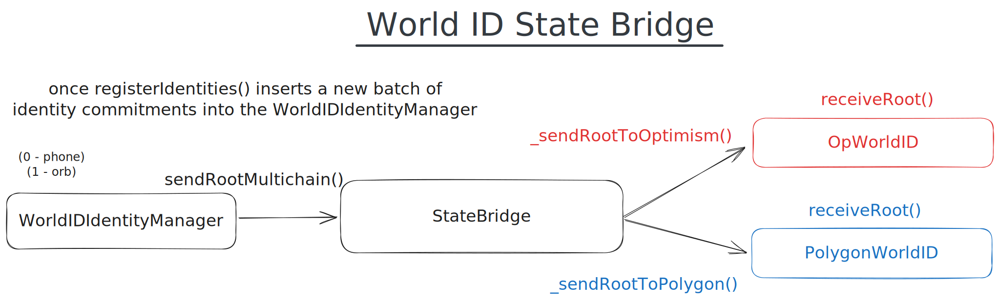

# world-id-state-bridge



## Description

State bridge between the WorldID Ethereum mainnet deployment and WorldID supported networks. The [spec](./docs/spec.md)
can be found in `docs/spec.md`.

## Deployments

The addresses of the contract deployments for production and staging can be found in
[`docs/deployments.md`](./docs/deployments.md).

## Supported networks

Currently, the supported networks are Polygon PoS (for backwards compatibility) and Optimism. The next iteration of the
bridge will most-likely be based on storage proofs and will support most EVM networks off the get-go, with other
networks pending storage proof verifier and Semaphore verifier implementations and deployments.

## Documentation

Run `make doc` to build and deploy a simple documentation webpage on [localhost:3000](https://localhost:3000). Uses
[`forge doc`](https://book.getfoundry.sh/reference/forge/forge-doc#forge-doc) under the hood and sources information
from the `world-id-state-bridge` contracts [NatSpec](https://docs.soliditylang.org/en/latest/natspec-format.html)
documentation.

## Usage

### Build

Build the contracts:

```sh
make build
```

### Clean

Delete the build artifacts and cache directories:

```sh
make clean
```

### Coverage

Get a test coverage report:

```sh
make coverage
```

### Format

Format the contracts with `forge fmt` and the rest of the files (.js, .md) with Prettier:

```sh
make format
```

### Gas Usage

Get a gas report:

```sh
make snapshot
```

```sh
make bench
```

### Lint

Lint the contracts:

```sh
make lint
```

### Test

Run the tests:

```sh
make test
```

### Environment

Clone `.env.example` to `.env`, fill the environment variables and `source .env` before running any scripts. Beware that
there is a different Etherscan API key for every single network that we are deploying a contract onto
([Ethereum](https://etherscan.io/myaccount), [Polygon](https://polygonscan.com/myaccount) and
[Optimism](https://optimistic.etherscan.io/login)- mainnet/testnet).

### Deploy

Deploy the WorldID state bridge and all its components to Ethereum mainnet using the CLI tool.

Integration with full system:

1. Deploy [`world-id-contracts`](https://github.com/worldcoin/world-id-contracts)
2. Get deployment address for `WorldIDIdentityManager`
3. Deploy [`world-id-state-bridge`](https://github.com/worldcoin/world-id-state-bridge) by running `make deploy`
   (requires 2.)
4. Get deployment address for `StateBridge`
5. Call
   [`setStateBridge`](https://github.com/worldcoin/world-id-contracts/blob/5f0f56c22b916815eecc82eef877d141acd7e139/src/WorldIDIdentityManagerImplV1.sol#L682-L707)
   on `WorldIDIdentityManager` with the output from 4.
6. Start inserting identities and monitor `PolygonWorldID` and `OpWorldID` for root updates (using
   [`signup-sequencer`](https://github.com/worldcoin/signup-sequencer))
7. Try and create a proof and call `verifyProof` on `OpWorldID` or `PolygonWorldID` to check whether everything works.

**Note:** Remember to call all functions that change state on these contracts via the owner address, which is the
deployer address by default.

#### Testnet

Deploy the WorldID state bridge and all its components to the Goerli testnet.

Integration with full system:

1. Deploy [`world-id-contracts`](https://github.com/worldcoin/world-id-contracts)
2. Get deployment address for `WorldIDIdentityManager`
3. Deploy [`world-id-state-bridge`](https://github.com/worldcoin/world-id-state-bridge) by running `make deploy-testnet`
   (requires 2.)
4. Get deployment address for `StateBridge`
5. Call
   [`setStateBridge`](https://github.com/worldcoin/world-id-contracts/blob/5f0f56c22b916815eecc82eef877d141acd7e139/src/WorldIDIdentityManagerImplV1.sol#L682-L707)
   on `WorldIDIdentityManager` with the output from 4.
6. Start inserting identities and monitor `PolygonWorldID` and `OpWorldID` for root updates (using
   [`signup-sequencer`](https://github.com/worldcoin/signup-sequencer))
7. Try and create a proof and call `verifyProof` on `OpWorldID` or `PolygonWorldID` to check whether everything works.

**Note:** Remember to call all functions that change state on these contracts via the owner address, which is the
deployer address by default.

#### Mock

Deploy the WorldID state bridge and a mock WorldID identity manager to the Goerli testnet for integration tests.

```sh
make mock
```

## Credits

This repo uses Paul Razvan Berg's [foundry template](https://github.com/paulrberg/foundry-template/): A Foundry-based
template for developing Solidity smart contracts, with sensible defaults.
