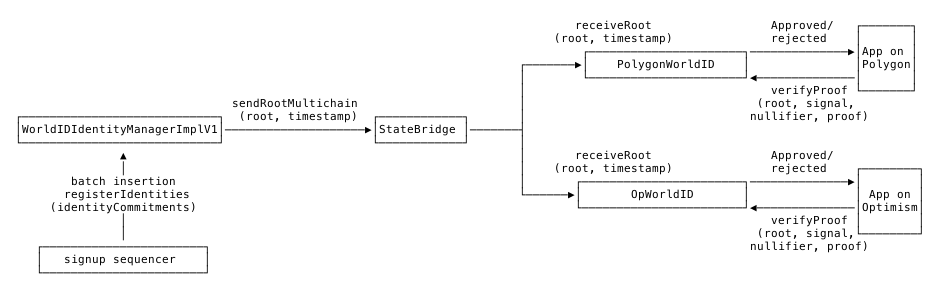

# State Bridge spec

Propagates new World ID merkle tree roots from the `WorldIDIdentityManager` contract
([`world-id-contracts`](https://github.com/worldcoin/world-id-contracts) repo) on Ethereum mainnet to Optimism, Base and
Polygon PoS (there is also a staging environment on Goerli testnets, more info in [deployments.md](./deployments.md)).

Currently there are 3 different state bridges which support Optimism, Base and Polygon PoS respectively. World ID merkle
tree roots are queried from the `WorldIDIdentityManager` contracts using the `latestRoot()` public method and propagated
to their respective chain using the `propagateRoot()` method.

## Polygon PoS state transfer infrastructure

In order to bridge state from Ethereum to Polygon the `PolygonStateBridge.sol` contract is currently using the
[FxPortal contracts](https://wiki.polygon.technology/docs/pos/design/bridge/l1-l2-communication/fx-portal/). It takes
about 20-40 minutes to sync the state from the state bridge to the `PolygonWorldID.sol` contract and about 1 hour to
checkpoint said state to the Polygon bridge on L1.

## Optimism L1<>L2 infrastructure

The `OpStateBridge.sol` contract uses the OP Stack chain native bridge contract `L1CrossDomainMessenger` and
`L2CrossDomainMessenger` to relay messages from L1 to L2. A guide can be found in the
[Optimism documentation](https://community.optimism.io/docs/developers/bridge/messaging/) to learn more about how this
mechanism works.

Assumption: Optimism Bridge currently relies on OP labs submitting output commitments, however they are working on
making it fully permissionless so that anyone can submit their own output commitment. The L2 node is used to fetch the
latest state root from the L1 contract and submits it to the L2 contract. So if we want to send a message to the
messenger on L1, that triggers a change in the canonical Optimism state that the Optimism sequencer has to include as a
transaction on the L2. That state transition goes through the fault proof mechanism so that if its not included in the
L2, the sequencer can be forced to include it by the fault proof mechanism (even economically punished in future
iterations of the protocol). Current time to relay message (estimation for Bedrock) is around 2 minutes for a message
from L1 to L2. Worst case scenario can be up to a couple of hours if sequencer is malicious and willingly doesn't want
to include the transition.
